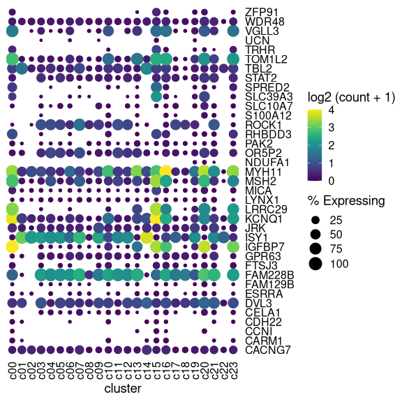

<!-- README.md is generated from README.Rmd. Please edit that file -->

# `aplot` for decorating a plot with associated information

## Example plots

Example taken from
<https://davemcg.github.io/post/lets-plot-scrna-dotplots/>

``` r
library(readr)
library(tidyr)
library(dplyr)
```

    ## 
    ## Attaching package: 'dplyr'

    ## The following objects are masked from 'package:stats':
    ## 
    ##     filter, lag

    ## The following objects are masked from 'package:base':
    ## 
    ##     intersect, setdiff, setequal, union

``` r
library(ggplot2)
library(ggtree)
```

    ## Registered S3 method overwritten by 'treeio':
    ##   method     from
    ##   root.phylo ape

    ## ggtree v2.1.3  For help: https://yulab-smu.github.io/treedata-book/
    ## 
    ## If you use ggtree in published research, please cite the most appropriate paper(s):
    ## 
    ## - Guangchuang Yu. Using ggtree to visualize data on tree-like structures. Current Protocols in Bioinformatics, 2020, 69:e96. doi:10.1002/cpbi.96
    ## - Guangchuang Yu, Tommy Tsan-Yuk Lam, Huachen Zhu, Yi Guan. Two methods for mapping and visualizing associated data on phylogeny using ggtree. Molecular Biology and Evolution 2018, 35(12):3041-3043. doi:10.1093/molbev/msy194
    ## - Guangchuang Yu, David Smith, Huachen Zhu, Yi Guan, Tommy Tsan-Yuk Lam. ggtree: an R package for visualization and annotation of phylogenetic trees with their covariates and other associated data. Methods in Ecology and Evolution 2017, 8(1):28-36, doi:10.1111/2041-210X.12628

    ## 
    ## Attaching package: 'ggtree'

    ## The following object is masked from 'package:tidyr':
    ## 
    ##     expand

``` r
file <- system.file("extdata", "scRNA_dotplot_data.tsv.gz", package="aplot")
gene_cluster <- readr::read_tsv(file)
```

    ## Parsed with column specification:
    ## cols(
    ##   Gene = col_character(),
    ##   cluster = col_character(),
    ##   cell_ct = col_double(),
    ##   cell_exp_ct = col_double(),
    ##   count = col_double(),
    ##   Group = col_character()
    ## )

``` r
dot_plot <- gene_cluster %>% 
  mutate(`% Expressing` = (cell_exp_ct/cell_ct) * 100) %>% 
  filter(count > 0, `% Expressing` > 1) %>% 
  ggplot(aes(x=cluster, y = Gene, color = count, size = `% Expressing`)) + 
  geom_point() + 
  cowplot::theme_cowplot() + 
  theme(axis.line  = element_blank()) +
  theme(axis.text.x = element_text(angle = 90, vjust = 0.5, hjust=1)) +
  ylab(NULL) +
  theme(axis.ticks = element_blank()) +
  scale_color_gradientn(colours = viridis::viridis(20), limits = c(0,4), oob = scales::squish, name = 'log2 (count + 1)') +
  scale_y_discrete(position = "right")


mat <- gene_cluster %>% 
  select(-cell_ct, -cell_exp_ct, -Group) %>%  # drop unused columns to faciliate widening
  pivot_wider(names_from = cluster, values_from = count) %>% 
  data.frame() # make df as tibbles -> matrix annoying
row.names(mat) <- mat$Gene  # put gene in `row`
mat <- mat[,-1] #drop gene column as now in rows
clust <- hclust(dist(mat %>% as.matrix())) # hclust with distance matrix

ggtree_plot <- ggtree::ggtree(clust)
```

    ## Warning: `mutate_()` is deprecated as of dplyr 0.7.0.
    ## Please use `mutate()` instead.
    ## See vignette('programming') for more help
    ## This warning is displayed once every 8 hours.
    ## Call `lifecycle::last_warnings()` to see where this warning was generated.

``` r
v_clust <- hclust(dist(mat %>% as.matrix() %>% t()))
ggtree_plot_col <- ggtree(v_clust) + layout_dendrogram()


labels= ggplot(gene_cluster, aes(cluster, y=1, fill=Group)) + geom_tile() +
  scale_fill_brewer(palette = 'Set1',name="Cell Type") + 
  theme_void() 

library(patchwork)
ggtree_plot | dot_plot | (ggtree_plot_col / labels)
```

<!-- -->

## Align plots with `aplot`

``` r
library(aplot)
dot_plot
```

<!-- -->

``` r
## the rows of the dot_plot was automatically reorder based on the tree
p2 <- dot_plot %>% 
  insert_left(ggtree_plot, width=.2) %>%
  insert_top(labels, height=.1) 
```

    ## Scale for 'y' is already present. Adding another scale for 'y', which will
    ## replace the existing scale.

``` r
p2
```

<!-- -->

``` r
## the columns of the dot_plot was automatically reorder based on the tree
p2 %>%
  insert_top(ggtree_plot_col, height=.2)
```

    ## the plot was flipped and the x limits will be applied to y-axis

    ## Scale for 'y' is already present. Adding another scale for 'y', which will
    ## replace the existing scale.

<!-- -->
