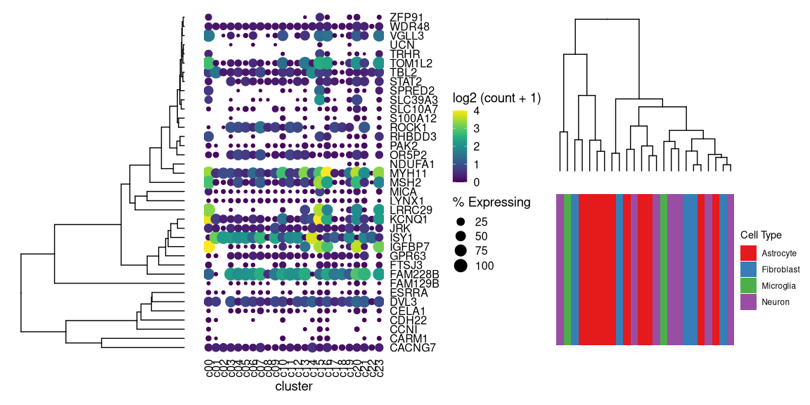
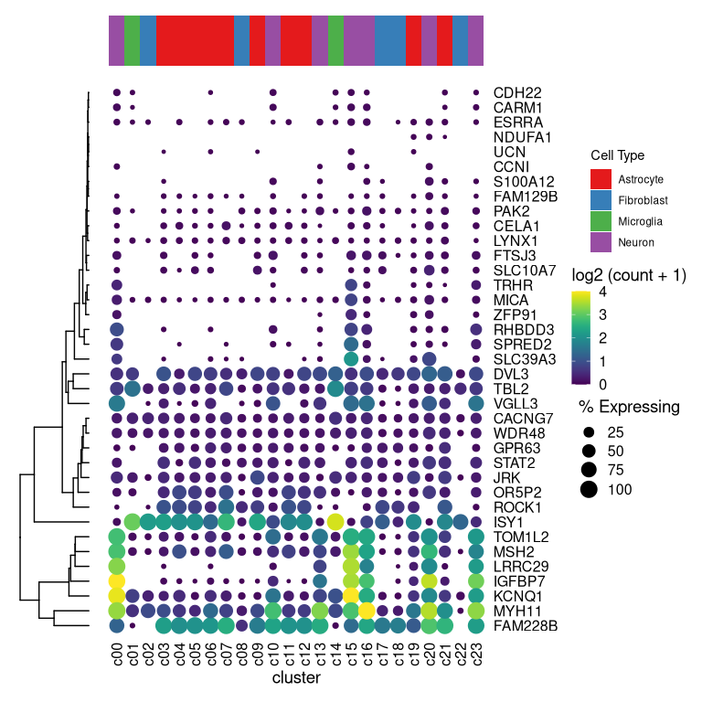

<!-- README.md is generated from README.Rmd. Please edit that file -->

# `aplot` for decorating a plot with associated information

## Example plots

Example taken from
<https://davemcg.github.io/post/lets-plot-scrna-dotplots/>

``` r
library(readr)
library(tidyr)
library(dplyr)
library(ggplot2)
library(ggtree)

file <- system.file("extdata", "scRNA_dotplot_data.tsv.gz", package="aplot")
gene_cluster <- readr::read_tsv(file)

dot_plot <- gene_cluster %>% 
  mutate(`% Expressing` = (cell_exp_ct/cell_ct) * 100) %>% 
  filter(count > 0, `% Expressing` > 1) %>% 
  ggplot(aes(x=cluster, y = Gene, color = count, size = `% Expressing`)) + 
  geom_point() + 
  cowplot::theme_cowplot() + 
  theme(axis.line  = element_blank()) +
  theme(axis.text.x = element_text(angle = 90, vjust = 0.5, hjust=1)) +
  ylab(NULL) +
  theme(axis.ticks = element_blank()) +
  scale_color_gradientn(colours = viridis::viridis(20), limits = c(0,4), oob = scales::squish, name = 'log2 (count + 1)') +
  scale_y_discrete(position = "right")


mat <- gene_cluster %>% 
  select(-cell_ct, -cell_exp_ct, -Group) %>%  # drop unused columns to faciliate widening
  pivot_wider(names_from = cluster, values_from = count) %>% 
  data.frame() # make df as tibbles -> matrix annoying
row.names(mat) <- mat$Gene  # put gene in `row`
mat <- mat[,-1] #drop gene column as now in rows
clust <- hclust(dist(mat %>% as.matrix())) # hclust with distance matrix

ggtree_plot <- ggtree::ggtree(clust)

v_clust <- hclust(dist(mat %>% as.matrix() %>% t()))
ggtree_plot_col <- ggtree(v_clust) + layout_dendrogram()


labels= ggplot(gene_cluster, aes(cluster, y=1, fill=Group)) + geom_tile() +
  scale_fill_brewer(palette = 'Set1',name="Cell Type") + 
  theme_void() 

library(patchwork)
ggtree_plot | dot_plot | (ggtree_plot_col / labels)
```

<!-- -->

## Align plots with `aplot`

``` r
library(aplot)
## the rows of the dot_plot was automatically reorder based on the tree
dot_plot %>% 
  insert_left(ggtree_plot, width=.2) 
```

<!-- -->

``` r
## the columns of the dot_plot was automatically reorder based on the tree
dot_plot %>% 
  insert_left(ggtree_plot, width=.2) %>%
  insert_top(labels, height=.02) %>%
  insert_top(ggtree_plot_col, height=.1)
```

<!-- -->
